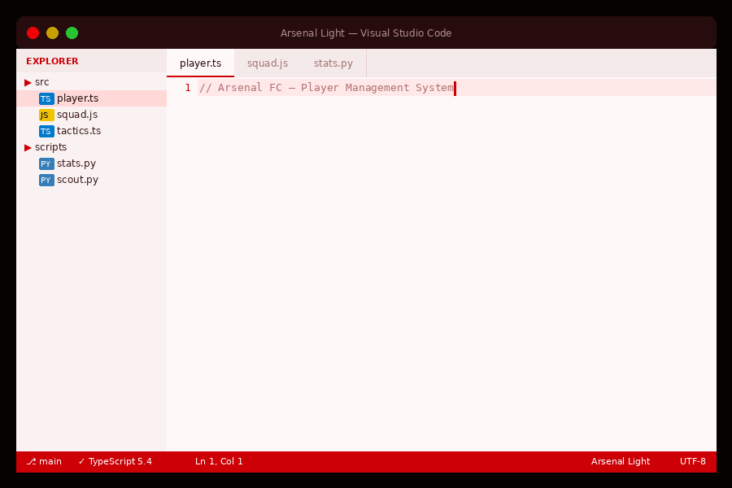

# Arsenal Theme

Dark and light themes for Visual Studio Code inspired by Arsenal FC.

Built around the club's iconic colours — **Gunners Red** for keywords and UI chrome, **Gold** for strings and decorators.

## Themes

### Arsenal Dark

Deep red-black backgrounds with vibrant red and gold accents.

### Arsenal Light

Warm white backgrounds with the same Arsenal red and gold palette, adapted for bright environments.

## Installation

1. Open **Extensions** in VS Code (`Ctrl+Shift+X`)
2. Search for `Arsenal Theme`
3. Click **Install**
4. Press `Ctrl+K, Ctrl+T` and select **Arsenal Dark** or **Arsenal Light**

## Supported Languages

TypeScript, JavaScript, Python, CSS, HTML, JSON, Markdown, and more.

## Feedback

Found a bug or want to suggest an improvement?
Open an issue on [GitHub](https://github.com/josephakayesi/arsenal-theme).
