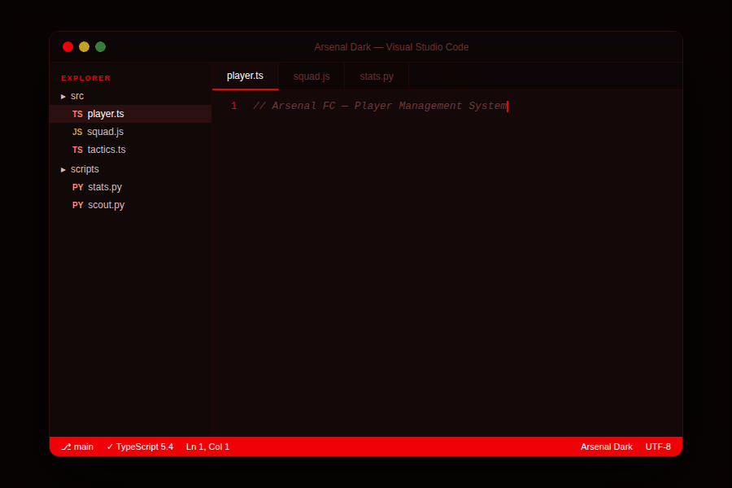

# Arsenal Dark

A dark theme for Visual Studio Code inspired by Arsenal FC.

Built around the club's iconic colours:

- **Gunners Red** — keywords, UI chrome
- **Gold** — strings, decorators
- **Deep red-black** — editor background

## Installation

1. Open **Extensions** in VS Code (`Ctrl+Shift+X`)
2. Search for `Arsenal Dark`
3. Click **Install**
4. Press `Ctrl+K, Ctrl+T` and select **Arsenal Dark**

## Supported Languages

TypeScript, JavaScript, Python, CSS, HTML, JSON, Markdown, and more.

## Feedback

Found a bug or want to suggest an improvement?
Open an issue on [GitHub](https://github.com/josephakayesi/arsenal-dark-theme).
